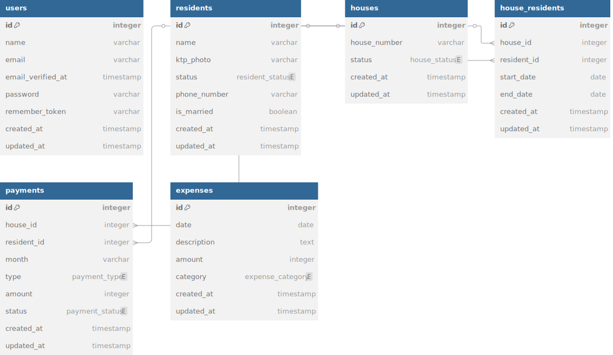

# Iuran RT - Test Progress

## Backend Laravel

Aplikasi backend ini dirancang untuk mendukung sistem administrasi RT, mencakup pengelolaan data penghuni, rumah, pembayaran iuran, dan pengeluaran operasional bulanan. Backend dibangun menggunakan **Laravel 10** dan mendukung dokumentasi API otomatis menggunakan **Swagger (L5 Swagger)**.

### **Fitur Utama**

* CRUD untuk:
  * Penghuni (`residents`)
  * Rumah (`houses`)
  * Hubungan rumah-penghuni (`house_residents`)
  * Pembayaran (`payments`)
  * Pengeluaran (`expenses`)
* Autentikasi pengguna menggunakan **Laravel Sanctum**
* Dokumentasi API otomatis dengan **Swagger (L5 Swagger)**
* Validasi berbasis **Form Request**
* Struktur API Resourceful

### Entity Relationship Diagram (ERD)



---

### **Instalasi & Setup Backend**

#### 1. Clone Repositori

```bash
git clone https://github.com/username/iuran-rt-backend.git
cd iuran-rt-backend
````

#### 2. Instal Dependensi

```bash
composer install
```

#### 3. Konfigurasi `.env`

```bash
cp .env.example .env
php artisan key:generate
```

Atur koneksi database di `.env`.

#### 4. Migrasi & Seeding

```bash
php artisan migrate --seed
```

#### 5. Jalankan Server

```bash
php artisan serve
```

---

### **Dokumentasi API dengan Swagger**

Swagger otomatis menghasilkan dokumentasi dari anotasi `@OA` yang ditulis di controller.
Setelah setup berhasil, akses dokumentasi melalui:

```
http://localhost:8000/api/documentation
```

Jika belum tersedia, generate dokumentasi dengan:

```bash
php artisan l5-swagger:generate
```

---

### **Struktur CRUD API**

| Resource       | Endpoint               | Keterangan                |
| -------------- | ---------------------- | ------------------------- |
| Residents      | `/api/residents`       | CRUD data penghuni        |
| Houses         | `/api/houses`          | CRUD data rumah           |
| HouseResidents | `/api/house-residents` | Relasi rumah dan penghuni |
| Payments       | `/api/payments`        | Data pembayaran bulanan   |
| Expenses       | `/api/expenses`        | Data pengeluaran bulanan  |

---

### **Autentikasi API (Sanctum)**

| Endpoint      | Method | Deskripsi              |
| ------------- | ------ | ---------------------- |
| `/api/login`  | POST   | Login pengguna         |
| `/api/logout` | POST   | Logout (auth\:sanctum) |
| `/api/user`   | GET    | Ambil user yang login  |

---

## Frontend React JS

Aplikasi frontend dibangun menggunakan **React.js + Vite + TailwindCSS**, dengan integrasi ke backend melalui **Laravel Sanctum Auth** dan **REST API**.

---

### **Panduan Instalasi Frontend (React)**

#### 1. Masuk ke direktori frontend

```bash
cd frontend
```

#### 2. Instal dependensi

```bash
npm install
```

#### 3. Konfigurasi environment

Buat file `.env`:

```bash
cp .env.example .env
```

Edit variabel berikut:

```env
VITE_API_URL=http://localhost:8000/api
VITE_API_BASE_URL=http://localhost:8000
```

#### 4. Jalankan React Dev Server

```bash
npm run dev
```

Akses di: `http://localhost:5173`

---

### **Status Fitur Frontend**

#### ✅ Mengelola Penghuni (Residents)

* CRUD lengkap dengan validasi
* Upload foto KTP
* Tabel list penghuni + form input/edit

#### ❌ Mengelola Rumah (Houses)

* Belum tersedia

#### ❌ Mengelola Pembayaran (Payments)

* Belum tersedia

---

## Lisensi

Proyek ini dikembangkan untuk keperluan seleksi dan pembelajaran.
